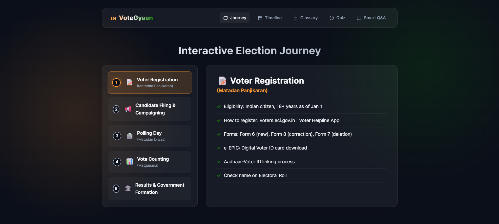
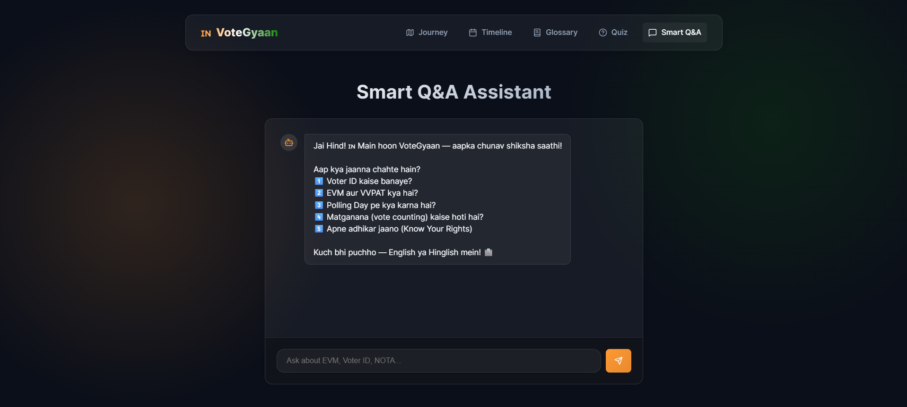
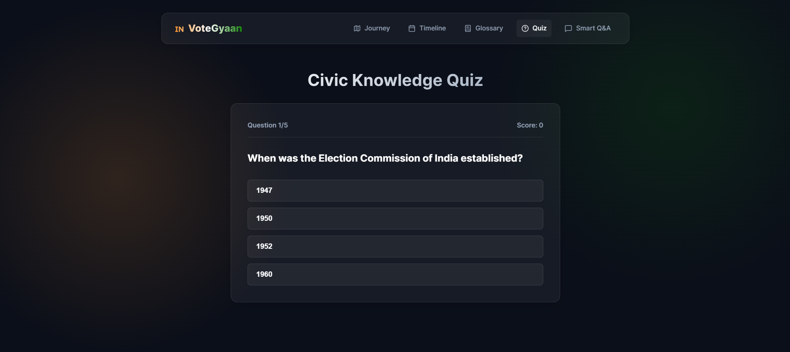
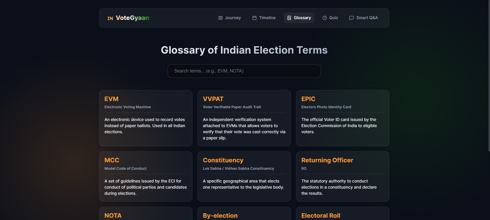

# VoteGyaan 🇮🇳

> An **intelligent, friendly, and non-partisan** AI assistant that educates Indian citizens about the electoral process.

[](https://votegyaan-frontend-938236899164.us-central1.run.app)
[](https://votegyaan-backend-938236899164.us-central1.run.app)
[](https://nodejs.org/)
[](https://cloud.google.com/run)

---

## 🌐 Live Demo

| Service | URL |
|---|---|
| **Frontend (Web App)** | [https://votegyaan-frontend-938236899164.us-central1.run.app](https://votegyaan-frontend-938236899164.us-central1.run.app) |
| **Backend API** | [https://votegyaan-backend-938236899164.us-central1.run.app](https://votegyaan-backend-938236899164.us-central1.run.app) |

---

## Overview

VoteGyaan is a full-stack civic education platform designed to empower Indian voters. Using Google's Gemini AI, it provides accurate, non-partisan information about every stage of the election—from voter registration to the final count.

---

## Architecture

- **Frontend**: React 19 + Vite + Vanilla CSS (Premium Glassmorphism Design)
- **Backend**: Node.js + Express
- **AI**: `@google/generative-ai` (Gemini API)
- **Infrastructure**: GCP Cloud Run (Serverless Containers)
- **Container Registry**: Google Artifact Registry (`us-central1`)

---

## Key Modules

### 1. Interactive Election Journey
A step-by-step visual walkthrough of the entire electoral lifecycle.


### 2. Smart Q&A Assistant
An AI chatbot grounded strictly in Indian electoral laws and facts.


### 3. Civic Knowledge Quiz
Test your understanding of democracy with interactive challenges.


### 4. Election Timeline & Glossary
Visual milestones and a searchable reference for all key electoral terms.


---

## Local Development

### Prerequisites

- Node.js **v20+** (required for Vite 8)
- A valid `GEMINI_API_KEY` from [Google AI Studio](https://aistudio.google.com/)

### 1. Start the Backend
```bash
cd backend
npm install
echo "GEMINI_API_KEY=your_key_here" > .env
npm start
```
*Runs on http://localhost:8080*

### 2. Start the Frontend
```bash
cd frontend
npm install
npm run dev
```
*Runs on http://localhost:5173*

---

## GCP Deployment Guide

The project is deployed as two independent Cloud Run services on GCP Project `votegyaan` (ID: `938236899164`).

### 1. Environment Setup
```bash
gcloud auth login
gcloud config set project votegyaan
gcloud services enable run.googleapis.com artifactregistry.googleapis.com cloudbuild.googleapis.com
```

### 2. Deploy Backend
```bash
cd backend
gcloud run deploy votegyaan-backend --source . --region us-central1 --allow-unauthenticated --set-env-vars GEMINI_API_KEY=your_key
```

### 3. Deploy Frontend
```bash
cd frontend
# Ensure API URLs in ChatAssistant.jsx and Quiz.jsx are updated to the backend URL
gcloud run deploy votegyaan-frontend --source . --region us-central1 --allow-unauthenticated --port 8080
```

---

## Repository
[github.com/aporiya/votegyaan](https://github.com/aporiya/votegyaan)
